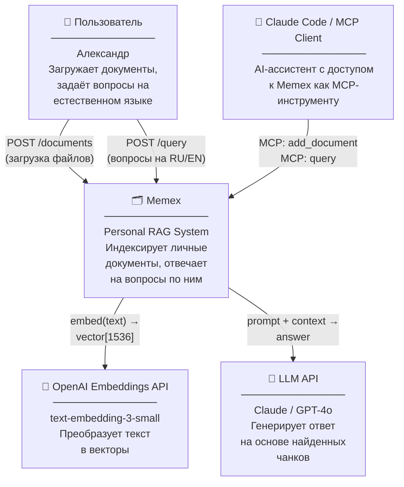

# C4 Model — Уровень 1: System Context

Кто взаимодействует с системой и через какие интерфейсы.

## Внешние системы

| Система | Роль | Протокол |
|---------|------|----------|
| OpenAI Embeddings API | Преобразование текста в векторы при индексации и поиске | HTTPS / REST |
| LLM API (Claude/GPT-4o) | Генерация ответа по найденным чанкам | HTTPS / REST |
| Claude Code / MCP Client | AI-ассистент, использующий Memex как инструмент | MCP (stdin/stdout) |

## Пользователи

**Один пользователь — владелец системы.** Личный инструмент, нет мультиарендности, нет аутентификации в MVP.

## Ключевые потоки

1. **Индексация:** пользователь / MCP → `POST /documents` → Ingestion Pipeline → OpenAI Embed → PostgreSQL
2. **Поиск:** пользователь / MCP → `POST /query` → Retrieval Pipeline → OpenAI Embed → PostgreSQL → Reranker → LLM → ответ
