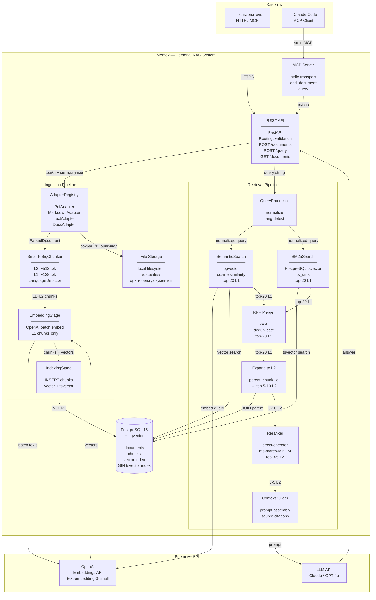

# C4 Model — Уровень 2: Container Diagram

Контейнеры системы, их ответственности и способы взаимодействия.



## Контейнеры

| Контейнер | Технология | Ответственность |
|-----------|-----------|----------------|
| REST API | FastAPI (Python) | Точка входа, routing, валидация запросов |
| MCP Server | Python MCP SDK | Обёртка над API для Claude Code / AI-клиентов |
| AdapterRegistry | Python Protocol | Выбор и запуск адаптера по типу источника |
| SmallToBigChunker | Python | Нарезка документа на L1/L2 чанки, language detection |
| EmbeddingStage | Python + OpenAI SDK | Батчевое получение векторов для L1 чанков |
| IndexingStage | Python + psycopg | INSERT документов и чанков в PostgreSQL |
| QueryProcessor | Python | Нормализация запроса, определение языка |
| SemanticSearch | Python + pgvector | Поиск по cosine similarity в векторном индексе |
| BM25Search | Python + psycopg | Полнотекстовый поиск через tsvector |
| RRF Merger | Python | Слияние двух ranked lists по формуле 1/(rank+60) |
| Expand to L2 | Python + psycopg | JOIN L1 → parent L2 чанков |
| Reranker | sentence-transformers | cross-encoder score(query, chunk) на CPU |
| ContextBuilder | Python | Сборка prompt со ссылками на источники |
| PostgreSQL + pgvector | PostgreSQL 15 | Хранение documents, chunks, векторный и tsvector индексы |
| File Storage | Local filesystem | Оригинальные файлы документов |

## Схема данных (ключевые таблицы)

```
documents
  id, source, mime_type, title, metadata JSONB,
  checksum, indexed_at

chunks
  id, doc_id → documents.id
  parent_chunk_id → chunks.id   (NULL для L2)
  chunk_role: 'parent'|'leaf'
  chunk_index, section_heading, section_level, page_number
  prev_chunk_id, next_chunk_id → chunks.id
  language
  content TEXT
  content_vector VECTOR(1536)   (только L1)
  tsv TSVECTOR                  (L1 и L2)
```

## Ключевые архитектурные решения

- ADR-0001: Adapter Layer — Protocol-based Registry
- ADR-0002: Chunking — Small-to-Big (L1=128 tok, L2=512 tok)
- ADR-0003: Retrieval — Hybrid Search (Semantic + BM25 + RRF)
- ADR-0004: Embedding — OpenAI text-embedding-3-small
- ADR-0005: Reranker — cross-encoder/ms-marco локально
- ADR-0006: Мультиязычность — Language Detection per Chunk
